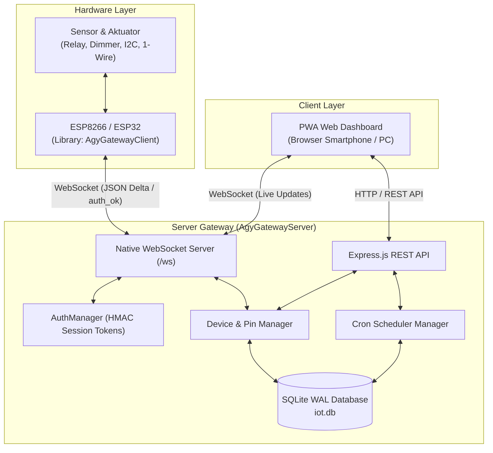

# AgyGatewayServer 🌐

[](https://nodejs.org)
[](https://expressjs.com)
[](https://github.com/websockets/ws)
[](https://github.com/WiseLibs/better-sqlite3)
[](https://developer.mozilla.org)
[](https://github.com/SiMahfud/AgyGatewayClient)
[](LICENSE)

**AgyGatewayServer** adalah platform gateway IoT modern, mandiri (on-premise / self-hosted), dan berkinerja tinggi yang dirancang sebagai pasangan resmi dari library C++ mikrokontroler [**AgyGatewayClient**](https://github.com/SiMahfud/AgyGatewayClient).

Server ini menyediakan komunikasi **WebSocket dua arah real-time**, dashboard web interaktif bertema modern berbasis **PWA (Progressive Web App)**, manajemen komponen pin dinamis, pemindai bus I2C jarak jauh, jadwal otomatis (*cron scheduler*), serta pembaruan firmware jarak jauh (*OTA Updates*) dengan umpan balik progres langsung.

---

## 📑 Daftar Isi

- [Fitur Utama](#-fitur-utama)
- [Arsitektur Sistem](#-arsitektur-sistem)
- [Panduan Instalasi Cepat](#-panduan-instalasi-cepat-5-menit)
- [Menjalankan di Mode Produksi (PM2)](#-menjalankan-di-mode-produksi-pm2)
- [Integrasi dengan Hardware (AgyGatewayClient)](#-integrasi-dengan-hardware-agygatewayclient)
- [Spesifikasi Protokol WebSocket](#-spesifikasi-protokol-websocket)
- [Referensi REST API](#-referensi-rest-api)
- [Struktur Proyek](#-struktur-proyek)
- [Troubleshooting & FAQ](#-troubleshooting--faq)
- [Lisensi](#-lisensi)

---

## 🌟 Fitur Utama

- ⚡ **Real-Time WebSocket Dua Arah**: Komunikasi latensi ultra-rendah untuk kontrol saklar instan dan transmisi telemetri delta tanpa overhead HTTP berulang.
- 📱 **Progressive Web App (PWA) Dashboard**: Antarmuka responsif dengan desain dark-mode modern, animasi mikro, dan dapat dipasang (*install*) di homescreen Android, iOS, maupun desktop PC.
- 🔐 **Handshake Autentikasi & Session Token**: Melindungi *Device Secret Key* dari pemaparan berulang. Setelah registrasi pertama, node mikrokontroler berkomunikasi menggunakan token sesi HMAC (`sess_...`).
- 🛠️ **Dynamic Pin Management (Zero-Recompile)**: Tambah saklar relay, tombol input, atau sensor baru langsung dari antarmuka Web tanpa perlu memprogram ulang mikrokontroler.
- 🔍 **Remote I2C Bus Scanner**: Pindai modul sensor I2C (BMP280, BH1750, SHT30, AHT10, dll.) yang terhubung ke ESP dari jarak jauh melalui klik tombol di dashboard.
- 💡 **Kontrol Dimmer & PWM Slider**: Mendukung pengaturan kecerahan lampu redup, kecepatan kipas exhaust, atau motor DC (0–100%).
- ⏳ **Independent Countdown Timers**: Perintah kontrol dapat menyertakan timer hitung mundur. Timer dijalankan mandiri di chip ESP agar tetap mematikan beban tepat waktu meskipun jaringan terputus.
- ⏰ **Advanced Cron Scheduler**: Jadwalkan aksi otomatis berdasarkan waktu (HH:MM) dan hari. Terintegrasi ke SQLite WAL dan file JSON watcher.
- 🚀 **Remote OTA Updates dengan Live Progress**: Unggah file firmware `.bin` ke server dan kirim instruksi update. Dashboard menampilkan persentase unduhan secara live (0–100%).
- 🎛️ **Virtual Pins Ala Blynk**: Mendukung penulisan dan pembacaan pin virtual (`V1`, `V2`, dst.) untuk otomasi logika kustom.
- 💾 **SQLite WAL Database**: Penyimpanan berkecepatan tinggi dengan Write-Ahead Logging (WAL) untuk mencatat riwayat telemetri, log perangkat, jadwal, dan kredensial admin.

---

## 🏗️ Arsitektur Sistem



---

## 🚀 Panduan Instalasi Cepat (5 Menit)

### 1. Prasyarat
Pastikan komputer / server Anda telah terpasang **Node.js** (versi 18 LTS atau lebih baru) dan **npm**:
```bash
node -v
npm -v
```

### 2. Clone Repository & Pasang Dependensi
```bash
git clone https://github.com/SiMahfud/AgyGatewayServer.git
cd AgyGatewayServer
npm install
```

### 3. Salin Konfigurasi Default
Salin file konfigurasi contoh `config.example.json` menjadi `config.json`:
```bash
# Windows PowerShell:
Copy-Item config.example.json config.json

# Linux / macOS:
cp config.example.json config.json
```

Edit file `config.json` sesuai kebutuhan:
```json
{
  "server": {
    "port": 3050,
    "wsPath": "/ws"
  },
  "auth": {
    "username": "admin",
    "password": "ganti_dengan_password_admin_anda",
    "deviceSecret": "wemos-secret-key-3377",
    "tokenSecret": "kunci-rahasia-acak-jwt-anda"
  },
  "iot": {
    "deviceTimeoutMs": 45000,
    "pingIntervalMs": 15000
  }
}
```

### 4. Jalankan Server
```bash
npm start
```
Buka browser Anda dan kunjungi: **`http://localhost:3050`**  
*(Login default: Username: `admin`, Password sesuai di `config.json`)*.

---

## 🛡️ Menjalankan di Mode Produksi (PM2)

Agar server IoT berjalan di latar belakang (*background*), otomatis menyala saat komputer boot ulang, dan pulih secara mandiri jika terjadi kegagalan:

1. Pasang **PM2** secara global:
   ```bash
   npm install -g pm2
   ```

2. Jalankan server dengan PM2:
   ```bash
   pm2 start server.js --name "iot-server"
   ```

3. Simpan daftar proses agar otomatis aktif setelah restart komputer:
   ```bash
   pm2 save
   pm2 startup
   ```

4. Perintah berguna lainnya:
   ```bash
   pm2 logs iot-server    # Memantau log real-time
   pm2 restart iot-server # Menjalankan ulang server
   pm2 stop iot-server    # Menghentikan server
   ```

---

## 🔌 Integrasi dengan Hardware (AgyGatewayClient)

Gunakan library [**AgyGatewayClient**](https://github.com/SiMahfud/AgyGatewayClient) di sketch Arduino / PlatformIO mikrokontroler Anda:

```cpp
#include <Arduino.h>
#include <AgyGatewayClient.h>

AgyGatewayClient iot;

void setup() {
  Serial.begin(115200);

  // 1. Hardware Watchdog & LED Status
  iot.enableWatchdog(8);
  iot.enableStatusLed(LED_BUILTIN, true);

  // 2. Aktifkan konfigurasi dinamis pin dari Web UI
  iot.enableDynamicPins(true);

  // 3. Hubungkan ke WiFi & Server Gateway
  // Format: begin(SSID, PASS, IP_SERVER, PORT, WS_PATH, DEVICE_ID, DEVICE_KEY)
  iot.begin("Nama_WiFi", "Sandi_WiFi", "192.168.1.100", 3050, "/ws", "node-kamar", "wemos-secret-key-3377");
}

void loop() {
  iot.loop();
}
```

---

## 📡 Spesifikasi Protokol WebSocket

### 1. Registrasi Hardware (`Client -> Server`)
Dikirim otomatis oleh node sesaat setelah WebSocket tersambung:
```json
{
  "event": "register",
  "deviceId": "node-kamar",
  "key": "wemos-secret-key-3377",
  "info": {
    "chip": "ESP8266",
    "firmware": "1.2.0",
    "uptime": 24,
    "rssi": -62,
    "dynamicPins": true
  },
  "components": [ ... ]
}
```

### 2. Balasan Handshake Autentikasi (`Server -> Client`)
Server memverifikasi `key` dan membalas dengan token sesi sementara:
```json
{
  "action": "auth_ok",
  "token": "sess_eyJkIjoidGVzdCIsImV4cCI6MTc4OTUyMTYzOH0.signature"
}
```

### 3. Delta Telemetri (`Client -> Server`)
Node mengirimkan perubahan nilai sensor/aktuator hanya dengan menyertakan token sesi:
```json
{
  "event": "telemetry",
  "deviceId": "node-kamar",
  "token": "sess_...",
  "uptime": 125,
  "rssi": -59,
  "delta": true,
  "data": {
    "lampu_tidur": "75",
    "suhu_ruang": "28.4"
  }
}
```

### 4. Kontrol Komponen (`Server -> Client`)
Mengatur saklar, dimmer PWM, atau timer countdown lokal:
```json
{
  "action": "set_component",
  "target": "node-kamar",
  "componentId": "relay_1",
  "value": true,
  "duration": 60
}
```

### 5. Progres OTA Update (`Client -> Server`)
Dilaporkan node setiap kelipatan 10% saat pengunduhan firmware:
```json
{
  "event": "ota_progress",
  "deviceId": "node-kamar",
  "percent": 40,
  "current": 184320,
  "total": 460800
}
```

### 6. Hasil Pemindaian Bus I2C (`Client -> Server`)
```json
{
  "event": "i2c_scan_result",
  "deviceId": "node-kamar",
  "devices": [
    { "address": "0x76", "name": "BMP280 / BME280", "category": "Suhu & Tekanan Udara" }
  ]
}
```

---

## 📋 Referensi REST API

Seluruh endpoint di bawah ini memerlukan header `Authorization: Bearer <TOKEN>` kecuali endpoint `/api/auth/login`.

| Method | Endpoint | Deskripsi |
|---|---|---|
| `POST` | `/api/auth/login` | Login admin, mengembalikan JWT session token. |
| `POST` | `/api/auth/change-password` | Mengubah password admin di SQLite dan config. |
| `GET` | `/api/devices` | Mendapatkan daftar seluruh perangkat yang terdaftar. |
| `DELETE`| `/api/devices/:deviceId` | Menghapus perangkat dari database. |
| `POST` | `/api/devices/:deviceId/components` | Menambahkan komponen GPIO / I2C baru ke hardware. |
| `DELETE`| `/api/devices/:deviceId/components/:id`| Menghapus komponen dari hardware dan database. |
| `POST` | `/api/devices/:deviceId/components/:id/control` | Mengontrol nilai komponen (Switch / Dimmer / Timer). |
| `GET` | `/api/devices/:deviceId/components/:id/history` | Riwayat grafik telemetri numerik. |
| `POST` | `/api/devices/:deviceId/scan-i2c` | Mengirim instruksi pemindaian bus I2C ke hardware. |
| `GET` | `/api/devices/:deviceId/scan-i2c` | Mengambil hasil scan I2C terakhir. |
| `POST` | `/api/devices/:deviceId/virtual-write` | Menulis data ke Virtual Pin Blynk (`pin`, `value`). |
| `POST` | `/api/devices/:deviceId/ota` | Memulai OTA Update jarak jauh (`firmwareUrl`). |
| `GET` | `/api/schedules` | Mendapatkan daftar jadwal timer/cron aktif. |
| `POST` | `/api/schedules` | Menambahkan jadwal otomatis baru. |
| `PUT` | `/api/schedules/:id` | Memperbarui jadwal. |
| `DELETE`| `/api/schedules/:id` | Menghapus jadwal. |
| `GET` | `/api/logs` | Mengambil catatan log aktivitas sistem. |

---

## 📁 Struktur Proyek

```text
AgyGatewayServer/
├── auth.js               # Manajemen autentikasi web & session token hardware
├── config.example.json   # Template konfigurasi bersih untuk publikasi git
├── config.json           # Konfigurasi aktif (diabaikan oleh .gitignore)
├── database.js           # Layer database SQLite WAL (relays, components, telemetry, logs)
├── deviceManager.js      # Manajemen state perangkat, soket, dan Dynamic Pins
├── schedulerManager.js   # Eksekutor jadwal otomatis node-cron
├── server.js             # Entrypoint server Express & WebSocket
├── firmwares/            # Direktori penyimpanan file biner firmware OTA (.bin)
│   └── .gitkeep
├── public/               # Frontend Progressive Web App (PWA)
│   ├── index.html        # Single Page Application HTML
│   ├── app.js            # Logika dashboard, WebSockets, dan kontrol komponen
│   ├── style.css         # Styling modern dark mode dan glassmorphism
│   ├── manifest.json     # PWA Web App Manifest
│   ├── icon.svg          # Ikon aplikasi vektor
│   └── sw.js             # Service Worker untuk dukungan offline caching
└── .gitignore            # Filter file sensitif, database, dan dependensi
```

---

## ❓ Troubleshooting & FAQ

#### Q: Mengapa mikrokontroler saya ditolak dengan kode status 4003?
**A**: Pastikan nilai `key` yang Anda atur pada `iot.begin()` di sketch mikrokontroler persis sama dengan nilai `auth.deviceSecret` pada file `config.json` di server (default: `wemos-secret-key-3377`).

#### Q: Bagaimana cara mengakses dashboard dari HP di jaringan WiFi yang sama?
**A**: Cari tahu alamat IP komputer server Anda (misal `192.168.1.50` via perintah `ipconfig` di Windows atau `ifconfig` di Linux). Kemudian di browser HP, buka: `http://192.168.1.50:3050`. Anda dapat mengklik menu browser **"Add to Home screen"** untuk menginstalnya sebagai aplikasi PWA.

#### Q: Apakah data perangkat hilang jika server dimatikan?
**A**: Tidak. Seluruh profil perangkat, pemetaan komponen pin dinamis, saklar, dan riwayat telemetri tersimpan aman di database SQLite berkecepatan tinggi (`iot.db`).

---

## 📄 Lisensi

Proyek ini dilisensikan di bawah lisensi **MIT License** — Anda bebas menggunakan, memodifikasi, dan mengintegrasikannya untuk kebutuhan personal maupun komersial.
